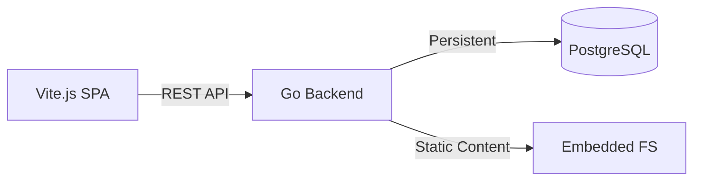

<div align="center">

### 📟 STB-Optimized Portfolio & Admin Workspace

_High-performance, low-latency personal platform for Home Lab environments._

[](#)
[](#)
[](#)

</div>

---

## 📜 `>_ PROJECT_SUMMARY`

Platform portofolio dan ruang kerja admin editorial versi ringan yang dioptimalkan khusus untuk perangkat **STB TV (Armbian)**. Menggunakan **Go** untuk pemrosesan _backend_ yang instan dan **Vite.js** untuk antarmuka _frontend_ yang responsif tanpa membebani memori sistem.

---

## 🛠️ `>_ THE_CHALLENGE`

> **Status:** Critical Resource Constraints  
> **Issue:** Memory Exhaustion (OOM)

Next.js (Node.js runtime) terbukti terlalu berat untuk dijalankan di STB dengan RAM terbatas, sering menyebabkan _high load_ atau _Out of Memory_ (OOM). Tantangan utamanya adalah:

- Memigrasi seluruh logika _server-side_ ke **Go** untuk efisiensi binari.
- Memastikan **Vite.js SPA** tetap _SEO-friendly_ di perangkat _low-resource_.
- Menghapus ketergantungan pada _runtime_ yang boros memori.

---

## 🏆 `>_ THE_OUTCOME`

Hasil akhirnya adalah platform yang sangat ringan dan berjalan lancar di perangkat STB (ARMv8). Dengan arsitektur baru ini, sistem mencatat:

| Metric        | Next.js (Legacy)   | Go + Vite (Current)      | Improvement       |
| :------------ | :----------------- | :----------------------- | :---------------- |
| **RAM Usage** | ~500MB - 1GB       | **~40MB - 100MB**        | **80% Reduction** |
| **Boot Time** | 30s - 1m           | **< 2s**                 | **Instant**       |
| **Payload**   | Heavy Node Modules | **Single Static Binary** | **Ultra Light**   |

> **Success:** Memungkinkan hosting mandiri (Self-hosting) di Home Lab tanpa lag sedikitpun.

---

## 🧰 `>_ TECH_STACK`



- **Backend Engine:** Golang (Standard Library + Chi/Fiber)
- **Frontend Core:** Vite.js + React 19
- **Data Layer:** PostgreSQL (Real Persisted Models)
- **Auth System:** Custom Go Session/JWT
- **Target OS:** Armbian / Linux ARM64

---

## 🚀 `>_ DEPLOYMENT_LOG`

```bash
# Clone the repository
git clone https://github.com/username/stb-portfolio.git

# Build & Run Backend (The Go Way)
cd backend && go build -o main .
./main

# Build & Serve Frontend
cd frontend && npm install && npm run build
```

---

<div align="center">
  
  
  <p><i>"Efisiensi adalah kunci dari kedaulatan digital di Home Lab."</i></p>
</div>
