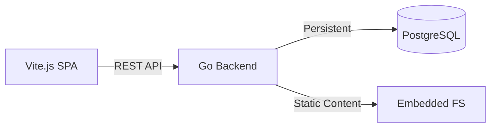

<div align="center">

### 📟 STB-Optimized Portfolio & Admin Workspace

_High-performance, low-latency personal platform for Home Lab environments._

[](#)
[](#)
[](#)

</div>

---

## 📜 `>_ PROJECT_SUMMARY`

A lightweight portfolio platform and editorial admin workspace optimized specifically for **STB TV devices (Armbian)**. It uses **Go** for fast backend processing and **Vite.js** for a responsive frontend without putting pressure on limited system memory.

---

## 🛠️ `>_ THE_CHALLENGE`

> **Status:** Critical Resource Constraints  
> **Issue:** Memory Exhaustion (OOM)

Next.js (Node.js runtime) proved too heavy to run on low-RAM STB hardware, often causing high load or _Out of Memory_ (OOM) conditions. The main challenges were:

- Migrating all _server-side_ logic to **Go** for binary efficiency.
- Keeping the **Vite.js SPA** _SEO-friendly_ on low-resource devices.
- Removing dependencies on memory-hungry runtimes.

---

## 🏆 `>_ THE_OUTCOME`

The result is a very lightweight platform that runs smoothly on STB devices (ARMv8). With the new architecture, the system achieves:

| Metric        | Next.js (Legacy)   | Go + Vite (Current)      | Improvement       |
| :------------ | :----------------- | :----------------------- | :---------------- |
| **RAM Usage** | ~500MB - 1GB       | **~40MB - 100MB**        | **80% Reduction** |
| **Boot Time** | 30s - 1m           | **< 2s**                 | **Instant**       |
| **Payload**   | Heavy Node Modules | **Single Static Binary** | **Ultra Light**   |

> **Success:** Enables self-hosting in a Home Lab environment without noticeable lag.

---

## 🧰 `>_ TECH_STACK`



- **Backend Engine:** Golang (Standard Library HTTP server)
- **Frontend Core:** Vite.js + React 19
- **Data Layer:** PostgreSQL (Real Persisted Models)
- **Auth System:** Custom Go Session/JWT
- **Target OS:** Armbian / Linux ARM64

---

## 🚀 `>_ DEPLOYMENT_LOG`

```bash
# Clone the repository
git clone https://github.com/rizaru-desu/my-website-turbo-repo.git
cd my-website-turbo-repo

# Install workspace dependencies
pnpm install

# Standard monorepo build with Turbo
pnpm build

# Build all apps and output a Linux amd64 backend binary
pnpm build:linux

# Build specifically for Armbian / Linux ARM64
pnpm build:linux:arm64

# Native backend build only
pnpm --filter api run build

# Run the native backend binary
./apps/backend/bin/server
```

Build artifacts:

- `pnpm build` keeps the regular Turbo workflow for the monorepo.
- `pnpm build:linux` builds both Vite frontends and emits `apps/backend/bin/server-linux-amd64`.
- `pnpm build:linux:arm64` builds both Vite frontends and emits `apps/backend/bin/server-linux-arm64`.
- `pnpm --filter api run build` emits the host-native backend binary at `apps/backend/bin/server`.

---

## 🛡️ `>_ SECURITY_REINFORCEMENT (OWASP Compliance)`

To ensure the platform remains secure despite running on low-resource hardware, the following security measures are implemented based on OWASP standards:

### 1. 🏗️ Backend Security (OWASP Top 10 Driven)

- **Injection Prevention:** Using prepared statements and parameterized queries via Go's database drivers to eliminate SQL Injection risks.
- **Broken Access Control:** Strict middleware-level authorization to ensure users can only access and modify their own data.
- **Cryptographic Failures:** Utilizing Argon2 or BCrypt for secure password hashing and enforcing TLS for data in transit.
- **Security Misconfiguration:** Implementing lightweight HTTP middleware for secure headers and strict CORS without adding heavy framework overhead.

### 2. 🎨 Frontend Security (OWASP ASVS Standard)

- **XSS (Cross-Site Scripting) Defense:** Leveraging React 19's built-in auto-escaping and implementing a strict Content Security Policy (CSP).
- **Sensitive Data Exposure:** Avoiding `localStorage` for sensitive tokens; utilizing `HttpOnly` and `SameSite` cookies for session management.
- **Vulnerable Components:** Regular automated dependency audits using `npm audit` and `Snyk` to ensure the frontend supply chain is clean.
- **CSRF Protection:** Enforcing Anti-CSRF tokens or strict Samesite cookie validation for all administrative state-changing operations.

---

## 🧱 `>_ BACKEND_HTTP_STRUCTURE`

The backend security refactor now follows a pragmatic clean architecture approach:

- `cmd/api` acts only as the composition root for server bootstrap, initial routes, and dependency wiring.
- `config/http.go` stores the default policy for `SecurityConfig` and `CORSConfig`, so policies can be changed without piling logic into `main.go`.
- `internal/delivery/http/middleware` contains the HTTP adapters for `NewSecurityHeaders` and `NewCORS`, because these concerns belong to the delivery layer, not the use case layer.
- Adapter tests are split by concern into `security_test.go` and `cors_test.go` so the delivery boundary stays clear and easy to maintain.

The active middleware currently includes:

- `Content-Security-Policy`
- `X-Frame-Options`
- `X-Content-Type-Options`
- `Referrer-Policy`
- `Permissions-Policy`
- `Cross-Origin-Opener-Policy`
- `Cross-Origin-Resource-Policy`
- `X-Permitted-Cross-Domain-Policies`
- `Strict-Transport-Security` only for HTTPS requests or HTTPS-aware proxy requests
- an `Access-Control-Allow-Origin` whitelist for allowed local frontend origins

## 🗄️ `>_ BACKEND_DATABASE_MIGRATIONS`

The backend uses Ent for typed PostgreSQL access, but automatic schema migration is disabled by default. Keep `DB_AUTO_MIGRATE=false` for staging and production so database changes are applied through reviewed versioned SQL files.

Migration layout:

- Ent schemas live in `apps/backend/internal/infrastructure/persistence/ent/schema`.
- Generated Ent clients live in `apps/backend/internal/infrastructure/persistence/ent`.
- Versioned SQL migrations live in `apps/backend/internal/infrastructure/persistence/migrations`.
- `apps/backend/atlas.hcl` documents the local Atlas migration environment.

Common workflow:

```bash
cd apps/backend

# Regenerate Ent client after schema changes
pnpm run ent:generate

# Create a new versioned migration with Atlas CLI
pnpm run migrate:diff -- add_next_change

# Apply migrations to DATABASE_URL from .env
pnpm run migrate:apply
```

`migrate:diff` uses `docker://postgres/15/dev?search_path=public` as the default dev database. Override it with `ATLAS_DEV_URL` if Docker is unavailable or if you prefer a local scratch database.

Backend verification can be run with:

```bash
cd apps/backend
env GOCACHE=/tmp/go-build-cache go test ./...
```

---

## 📝 `>_ DEVELOPMENT_TODOS`

### 🏗️ Backend Security (OWASP Hardening)

- [x] **Security Headers:** Apply lightweight Go middleware for CSP, conditional HSTS, X-Frame-Options, Referrer-Policy, and related hardening headers.
- [ ] **Rate Limiting:** Implement `didip/tollbooth` on sensitive endpoints (Auth/API) to prevent brute-force attacks.
- [ ] **Strict Validation:** Replace manual checks with `go-playground/validator/v10` for all incoming request structs.
- [x] **CORS Policy:** Define a strict whitelist of allowed origins via config-driven delivery middleware instead of wildcard `*`.
- [ ] **Vulnerability Scanning:** Add `govulncheck` to the CI/CD or pre-commit hooks to audit dependencies.

### 🎨 Frontend Security (OWASP Defense)

- [ ] **CSP Implementation:** Set up a strict Content Security Policy meta tag to mitigate XSS risks.
- [ ] **Secure Session:** Migrate token storage to `HttpOnly` and `Secure` cookies to prevent token theft via script injection.
- [ ] **Dependency Audit:** Run `npm audit` and prune unused or vulnerable packages from `node_modules`.
- [ ] **Input Sanitization:** Ensure all user-generated content is sanitized before rendering to prevent DOM-based XSS.

---

### 📊 System Monitoring & Health (STB Specific)

- [ ] **Resource Metrics:** Implement local system calls to fetch CPU and RAM usage percentage.
- [ ] **Storage Watcher:** Add disk space monitoring to prevent OOM or write failures on STB internal storage.
- [ ] **Formatted Output:** Create a helper to convert bytes into human-readable formats (MB, GB).
- [x] **Health Endpoint:** Expose a protected `/api/v1/health` route for real-time monitoring dashboard.

---

<div align="center">
  
  
  <p><i>"Efficiency is the foundation of digital sovereignty in the Home Lab."</i></p>
</div>
